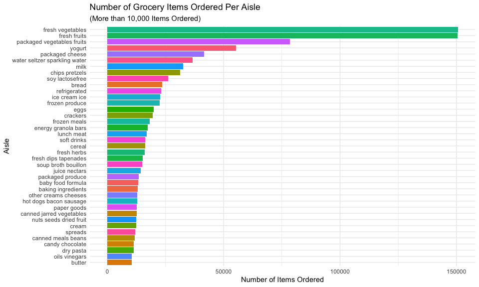

p8105 Homework 3
================
Maria Serafini

## Problem 1

**This code chunk loads the p8105 `instacart` data, which is a clean and
limited version of The “Instacart Online Grocery Shopping Dataset 2017”
and contains information about instacart online grocery orders**

``` r
data("instacart")
```

The `instacart` data contains 1384617 observations and 15 variables and
provides information on the instacart grocery orders of 131209 users
with each row representing a product from an order. The `product_name`
variable identifies the product ordered and the `aisle` variable
indicates which aisle the ordered item came from. The dataset also
includes the variables `add_to_cart_order`, which gives the sequence of
products purchased in each order, and `reorder`, which indicates whether
that item was ordered by the user in the past. The week and hour of day
the order was placed is given by `order_dow` and `order_hour_of_day`,
respectively.

There are a total of 134 aisles and the three aisles with the most items
ordered are fresh vegetables, fresh fruits, packaged vegetables fruits
with 150609, 150473, 78493 items ordered for each aisle, respectively.

**This code chunk creates a plot of the number of items ordered per
aisle. We group by aisle and count the number of items ordered per
aisle, filtering to only include aisles with 10,000 or more items
ordered. We then create a plot to visualize the number of items ordered
per aisle with the aisles arranged from most to least number of items
ordered. We remove the legend for clarity and add labels for
readability**

``` r
instacart |> 
  group_by(aisle) |> 
  summarize(
    aisle_items_ordered = n()
  ) |> 
  filter(aisle_items_ordered > 10000) |> 
  ggplot(aes(x = aisle_items_ordered, y = reorder(aisle, aisle_items_ordered), fill = aisle)) +
  geom_col() +
  theme(legend.position = "none") +
  labs(
    x = "Number of Items Ordered", 
    y = "Aisle", 
    title = "Number of Grocery Items Ordered Per Aisle",
    subtitle = "(More than 10,000 Items Ordered)"
  )
```



# 

The table below shows the top 3 most ordered items for the aisles
“Baking Ingredients”, “Dog Food Care”, and “Packages Vegetables Fruits”.
The top three ordered baking items were “Light Brown Sugar” with 499
orders, “Pure Baking Soda” with 387 orders, and “Cane Sugar” with 336
orders. The top three most ordered dog food items were “Snack Sticks
Chicken & Rice Recipe Dog Treats” with 30 orders, “Organix Chicken &
Brown Rice Recipe” with 28 orders, and “Small Dog Biscuits” with 26
orders. Finally, the top three items ordered from packaged vegetables
and fruits were “Organic Baby Spinach” with 9,784 orders, “Organic
Raspberries” with 5,546 orders, and “Organic Blueberries” with 4,966
orders.

``` r
instacart |> 
  filter(aisle %in% c("baking ingredients", "dog food care", "packaged vegetables fruits")) |>
  mutate(
    aisle = case_match(
      aisle,
      "baking ingredients" ~ "Baking Ingrdients",
      "dog food care" ~ "Dog Food Care",
      "packaged vegetables fruits" ~ "Packaged Vegetables Fruits"
    )
  ) |> 
  group_by(aisle, product_name) |> 
  summarize(
    item_count = n(), .groups = "drop_last"
  ) |> 
  arrange(aisle, desc(item_count)) |> 
  slice_head(n = 3) |>
  knitr::kable(
    col.names = c("Aisle", "Product", "Number of Times Ordered")
  )
```

| Aisle | Product | Number of Times Ordered |
|:---|:---|---:|
| Baking Ingrdients | Light Brown Sugar | 499 |
| Baking Ingrdients | Pure Baking Soda | 387 |
| Baking Ingrdients | Cane Sugar | 336 |
| Dog Food Care | Snack Sticks Chicken & Rice Recipe Dog Treats | 30 |
| Dog Food Care | Organix Chicken & Brown Rice Recipe | 28 |
| Dog Food Care | Small Dog Biscuits | 26 |
| Packaged Vegetables Fruits | Organic Baby Spinach | 9784 |
| Packaged Vegetables Fruits | Organic Raspberries | 5546 |
| Packaged Vegetables Fruits | Organic Blueberries | 4966 |

# 

The table below shows the mean hour of the day each of the products,
Coffee Ice Cream and Pink Lady Apples, were ordered for each day of the
week. The earliest mean hour of the day Coffee Ice Cream was ordered was
12.26 on Friday and the latest mean hour was 15.38 on Tuesday. The
earliest mean hour of the day Pink Lady Apples were ordered was 11.36 on
Monday and the latest was 14.25 on Wednesday. Overall the mean hour of
the day Pink lady Apples were ordered was earlier than the mean hour of
the day Coffee Ice Cream was ordered for all days except Friday (12.78
vs 12.26, respectively).

``` r
instacart |> 
  filter(product_name %in% c("Pink Lady Apples", "Coffee Ice Cream")) |> 
  mutate(
    order_dow = case_match(
      order_dow,
      0 ~ "Sunday",
      1 ~ "Monday",
      2 ~ "Tuesday", 
      3 ~ "Wednesday", 
      4 ~ "Thursday", 
      5 ~ "Friday",
      6 ~ "Saturday"),
    order_dow = factor(
      order_dow,
      levels = c("Sunday","Monday","Tuesday","Wednesday","Thursday","Friday","Saturday"),
      ordered = TRUE)
    ) |> 
  group_by(product_name, order_dow) |> 
  summarize(
    mean_hour_of_day = mean(order_hour_of_day, na.rm = TRUE), .groups = "drop"
  ) |> 
  pivot_wider(
    names_from = order_dow,
    values_from = mean_hour_of_day
  ) |> 
  arrange(product_name) |> 
  rename("Product Name" = product_name) |> 
  knitr::kable(digits = 2)
```

| Product Name     | Sunday | Monday | Tuesday | Wednesday | Thursday | Friday | Saturday |
|:-----------------|-------:|-------:|--------:|----------:|---------:|-------:|---------:|
| Coffee Ice Cream |  13.77 |  14.32 |   15.38 |     15.32 |    15.22 |  12.26 |    13.83 |
| Pink Lady Apples |  13.44 |  11.36 |   11.70 |     14.25 |    11.55 |  12.78 |    11.94 |
