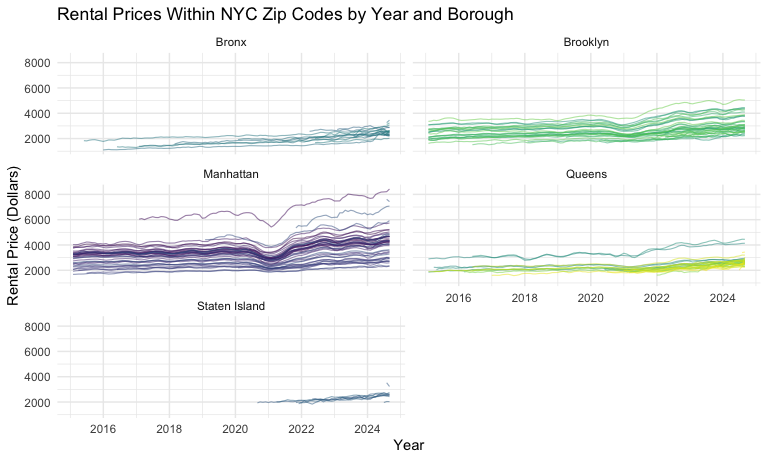

p8105 Homework 3
================
Maria Serafini

## Problem 1

**This code chunk loads the p8105 `instacart` data, which is a clean and
limited version of The “Instacart Online Grocery Shopping Dataset 2017”
and contains information about instacart online grocery orders**

``` r
data("instacart")
```

The `instacart` data contains 1384617 observations and 15 variables and
provides information on the instacart grocery orders of 131209 users
with each row representing a product from an order. The `product_name`
variable identifies the product ordered and the `aisle` variable
indicates which aisle the ordered item came from. The dataset also
includes the variables `add_to_cart_order`, which gives the sequence of
products purchased in each order, and `reorder`, which indicates whether
that item was ordered by the user in the past. The week and hour of day
the order was placed is given by `order_dow` and `order_hour_of_day`,
respectively.

There are a total of 134 aisles and the three aisles with the most items
ordered are fresh vegetables, fresh fruits, packaged vegetables fruits
with 150609, 150473, 78493 items ordered for each aisle, respectively.

**This code chunk creates a plot of the number of items ordered per
aisle. We group by aisle and count the number of items ordered per
aisle, filtering to only include aisles with 10,000 or more items
ordered. We then create a plot to visualize the number of items ordered
per aisle with the aisles arranged from most to least number of items
ordered. We remove the legend for clarity and add labels for
readability**

``` r
instacart |> 
  group_by(aisle) |> 
  summarize(
    aisle_items_ordered = n()
  ) |> 
  filter(aisle_items_ordered > 10000) |> 
  ggplot(aes(x = aisle_items_ordered, y = reorder(aisle, aisle_items_ordered), fill = aisle)) +
  geom_col() +
  theme(legend.position = "none") +
  labs(
    x = "Number of Items Ordered", 
    y = "Aisle", 
    title = "Number of Grocery Items Ordered Per Aisle",
    subtitle = "(More than 10,000 Items Ordered)"
  )
```


# 

The table below shows the top 3 most ordered items for the aisles
“Baking Ingredients”, “Dog Food Care”, and “Packages Vegetables Fruits”.
The top three ordered baking items were “Light Brown Sugar” with 499
orders, “Pure Baking Soda” with 387 orders, and “Cane Sugar” with 336
orders. The top three most ordered dog food items were “Snack Sticks
Chicken & Rice Recipe Dog Treats” with 30 orders, “Organix Chicken &
Brown Rice Recipe” with 28 orders, and “Small Dog Biscuits” with 26
orders. Finally, the top three items ordered from packaged vegetables
and fruits were “Organic Baby Spinach” with 9,784 orders, “Organic
Raspberries” with 5,546 orders, and “Organic Blueberries” with 4,966
orders.

``` r
instacart |> 
  filter(aisle %in% c("baking ingredients", "dog food care", "packaged vegetables fruits")) |>
  mutate(
    aisle = case_match(
      aisle,
      "baking ingredients" ~ "Baking Ingrdients",
      "dog food care" ~ "Dog Food Care",
      "packaged vegetables fruits" ~ "Packaged Vegetables Fruits"
    )
  ) |> 
  group_by(aisle, product_name) |> 
  summarize(
    item_count = n(), .groups = "drop_last"
  ) |> 
  arrange(aisle, desc(item_count)) |> 
  slice_head(n = 3) |>
  knitr::kable(
    col.names = c("Aisle", "Product", "Number of Times Ordered")
  )
```

| Aisle | Product | Number of Times Ordered |
|:---|:---|---:|
| Baking Ingrdients | Light Brown Sugar | 499 |
| Baking Ingrdients | Pure Baking Soda | 387 |
| Baking Ingrdients | Cane Sugar | 336 |
| Dog Food Care | Snack Sticks Chicken & Rice Recipe Dog Treats | 30 |
| Dog Food Care | Organix Chicken & Brown Rice Recipe | 28 |
| Dog Food Care | Small Dog Biscuits | 26 |
| Packaged Vegetables Fruits | Organic Baby Spinach | 9784 |
| Packaged Vegetables Fruits | Organic Raspberries | 5546 |
| Packaged Vegetables Fruits | Organic Blueberries | 4966 |

# 

The table below shows the mean hour of the day each of the products,
Coffee Ice Cream and Pink Lady Apples, were ordered for each day of the
week. The earliest mean hour of the day Coffee Ice Cream was ordered was
12.26 on Friday and the latest mean hour was 15.38 on Tuesday. The
earliest mean hour of the day Pink Lady Apples were ordered was 11.36 on
Monday and the latest was 14.25 on Wednesday. Overall the mean hour of
the day Pink lady Apples were ordered was earlier than the mean hour of
the day Coffee Ice Cream was ordered for all days except Friday (12.78
vs 12.26, respectively).

``` r
instacart |> 
  filter(product_name %in% c("Pink Lady Apples", "Coffee Ice Cream")) |> 
  mutate(
    order_dow = case_match(
      order_dow,
      0 ~ "Sunday",
      1 ~ "Monday",
      2 ~ "Tuesday", 
      3 ~ "Wednesday", 
      4 ~ "Thursday", 
      5 ~ "Friday",
      6 ~ "Saturday"),
    order_dow = factor(
      order_dow,
      levels = c("Sunday","Monday","Tuesday","Wednesday","Thursday","Friday","Saturday"),
      ordered = TRUE)
    ) |> 
  group_by(product_name, order_dow) |> 
  summarize(
    mean_hour_of_day = mean(order_hour_of_day, na.rm = TRUE), .groups = "drop"
  ) |> 
  pivot_wider(
    names_from = order_dow,
    values_from = mean_hour_of_day
  ) |> 
  arrange(product_name) |> 
  rename("Product Name" = product_name) |> 
  knitr::kable(digits = 2)
```

| Product Name     | Sunday | Monday | Tuesday | Wednesday | Thursday | Friday | Saturday |
|:-----------------|-------:|-------:|--------:|----------:|---------:|-------:|---------:|
| Coffee Ice Cream |  13.77 |  14.32 |   15.38 |     15.32 |    15.22 |  12.26 |    13.83 |
| Pink Lady Apples |  13.44 |  11.36 |   11.70 |     14.25 |    11.55 |  12.78 |    11.94 |

## Problem 2

**This chunk imports and cleans the Zillow NYC rental data and ZIP code
data.**

``` r
nyc_zori_df <-
  read_csv("data/Zip_zori_uc_sfrcondomfr_sm_month_NYC.csv") |> 
  pivot_longer(
    -(RegionID:CountyName),
    names_to = "month",
    values_to = "price") |> 
  janitor::clean_names() |> 
  rename(zip_code = region_name) |> 
  mutate(
    month = as_date(month),
    year = floor_date(month, unit = "year"),
    zip_code = as.numeric(zip_code)) |> 
  select(-county_name)
```

    ## Rows: 149 Columns: 125
    ## ── Column specification ────────────────────────────────────────────────────────
    ## Delimiter: ","
    ## chr   (6): RegionType, StateName, State, City, Metro, CountyName
    ## dbl (119): RegionID, SizeRank, RegionName, 2015-01-31, 2015-02-28, 2015-03-3...
    ## 
    ## ℹ Use `spec()` to retrieve the full column specification for this data.
    ## ℹ Specify the column types or set `show_col_types = FALSE` to quiet this message.

``` r
zip_codes_df <-
  read_csv("data/Zip Codes.csv") |> 
  janitor::clean_names() |> 
  filter(
    !(zip_code == 10463 & county == "New York"),
    !(zip_code == 11201 & county == "New York")) |> 
  mutate(
    borough = case_match(
      county,
      "Bronx" ~ "Bronx",
      "Kings" ~ "Brooklyn",
      "New York" ~ "Manhattan",
      "Queens" ~ "Queens",
      "Richmond" ~ "Staten Island"
    )
  ) |> 
  select(zip_code, borough, neighborhood)
```

    ## Rows: 322 Columns: 7
    ## ── Column specification ────────────────────────────────────────────────────────
    ## Delimiter: ","
    ## chr (4): County, County Code, File Date, Neighborhood
    ## dbl (3): State FIPS, County FIPS, ZipCode
    ## 
    ## ℹ Use `spec()` to retrieve the full column specification for this data.
    ## ℹ Specify the column types or set `show_col_types = FALSE` to quiet this message.

``` r
nyc_rental_df = 
  left_join(nyc_zori_df, zip_codes_df, by = "zip_code")
```

There are 48 zip codes observed in all 116 months between January 2015
and August 2024 and 26 zip codes observed in fewer than 10 of the
months. The zip codes that appear in every month, such as 10001 and
10014 are areas of NYC with consistent rental markets (add details)

# 

The table below shows the mean rental price in each borough of NYC by
year.

``` r
nyc_rental_df |> 
  group_by(borough, year) |> 
  summarize(mean_price = mean(price, na.rm = TRUE), .groups = "drop") |> 
  pivot_wider(
    names_from = borough, 
    values_from = mean_price
  ) |> 
  mutate(year = year(as.Date(year))) |> 
  rename("Year" = year) |> 
  knitr::kable(digits = 0)
```

| Year | Bronx | Brooklyn | Manhattan | Queens | Staten Island |
|-----:|------:|---------:|----------:|-------:|--------------:|
| 2015 |  1760 |     2493 |      3022 |   2215 |           NaN |
| 2016 |  1520 |     2520 |      3039 |   2272 |           NaN |
| 2017 |  1544 |     2546 |      3134 |   2263 |           NaN |
| 2018 |  1639 |     2547 |      3184 |   2292 |           NaN |
| 2019 |  1706 |     2631 |      3310 |   2388 |           NaN |
| 2020 |  1811 |     2555 |      3107 |   2316 |          1978 |
| 2021 |  1858 |     2550 |      3137 |   2211 |          2045 |
| 2022 |  2054 |     2868 |      3778 |   2406 |          2147 |
| 2023 |  2285 |     3015 |      3933 |   2562 |          2333 |
| 2024 |  2497 |     3126 |      4078 |   2694 |          2536 |

# 

The plot below shows NYC rental prices within each ZIP code by available
year and separated by borough with each line representing a ZIP code
within each respective borough. Looking at the plot, we can see that
Manhattan and Brooklyn rental prices were fairly stable across ZIP codes
through 2020, with a significant decrease in prices between 2020 and
2021 and a significant increase bwtween 2021 and 2022. This noticable
dip represents the decrease in rental prices following the COVID-19
pandemic as residents temporarily and permanantly left the city and the
demand for rentals decreased, followed by the increased demand for
rentals following the end of COVID-19 lockdowns. From 2022 to 2024,
rental prices in Manhattan and Brooklyn have steadily increased. Rental
prices in the Bronx and Queens have remained fairly stable with a slight
increasing trend across years.Staten Island rental prices also appear to
be mostly consistent across ZIP Codes and steadily increasing
year-to-year. It is notable that Staten Island did not have any data on
rental prices prior to 2020, suggesting a growing rental market in this
borough.

``` r
nyc_yearly_rental_plot <- nyc_rental_df |> 
  select(zip_code, price, month, year, borough) |> 
  mutate(
    zip_code = as.factor(zip_code)
  ) |> 
  drop_na() |> 
  ggplot(aes(x = month, y = price, group = zip_code, color = zip_code)) +
  geom_line(alpha = 0.5, linewidth = 0.4) +
  #geom_smooth(aes(group = borough), se = FALSE) +
  theme(legend.position = "none") +
  facet_wrap(~borough, ncol = 2) +
  labs(
    title = "Rental Prices Within NYC Zip Codes by Year and Borough",
    x = "Year",
    y = "Rental Price (Dollars)")

print(nyc_yearly_rental_plot)
```



# 

The plot below shows the distribution of the average monthly ZIP
code-level rental prices across the boroughs of NYC in 2023. Looking at
the plot, we can see that Manhattan has the highest rental prices and
widest spread indicating large variability in prices between ZIP codes.
Brooklyn’s average monthly rental prices are lower when compared to
Manhattan, but still show moderate variability between ZIP codes. Bronx,
Queens, and Staten Island have the lowest average rental prices and less
spread, suggesting similar and generally more affordable rental prices
across ZIP codes. However, Queens has a number of outlying ZIP codes
with much higher rental prices than the average for the borough,
indicating that number of ZIP codes in this borough are significantly
more expensive for renters.

``` r
nyc_rental_2023_plot <- nyc_rental_df |> 
  filter(year %in% "2023-01-01") |> 
  select(zip_code, price, month, year, borough) |> 
  group_by(borough, zip_code, month) |> 
  summarize(
    mean_price = mean(price, na.rm = TRUE), .groups = "drop"
  ) |> 
  drop_na() |> 
  ggplot(aes(x = borough, y = mean_price, fill = borough))+
  geom_violin(alpha = 0.5, trim = FALSE) +
  geom_boxplot(alpha = 0.5, outlier.shape = 1.0) +
  labs(
    title = "Distribution of Average Monthly ZIP Code-level Rental Prices Across NYC",
    x = "Borough", 
    y = "Average Monthly Rental Price (Dollars)"
  ) +
  theme(legend.position = "none")

print(nyc_rental_2023_plot)
```


**This code chunk combines the `nyc_yearly_rental_plot` and
`nyc_rental_2023_plot` above using patchwork**

``` r
nyc_yearly_rental_plot + nyc_rental_2023_plot
```


## Problem 3

**This chunk loads, cleans, and merges the demographic and accelerometer
data of 250 participants in the National Health and Nutrition
Examination Survey (NHANES). The demographic data is filtered to exclude
participants less than 21 year old and participants with missing
demographic data; we also encode the education variable as a factor
variable in order of increasing education level. The accelerometer data
is converted to long format and we created ‘minute of the day’ and mims
value variables; we also encode the minute of day variable as a factor
variable in ascending order of minutes of the day over 24 hours. We then
join the two datasets using the participant’s respondent sequence
number**

``` r
nhanes_demo_df <- 
  read_csv("data/nhanes_covar.csv", skip = 4, na = c("NA", "")) |> 
  janitor::clean_names() |> 
  filter(age >= 21) |> 
  mutate(
    sex = case_match(
      sex,
      1 ~ "male",
      2 ~ "female"),
   education = factor(
     education, 
     levels = c(1, 2, 3), 
     labels = c("less than high school", "high school equivalent", "more than high school")
     )
   ) |> 
  drop_na()
```

    ## Rows: 250 Columns: 5
    ## ── Column specification ────────────────────────────────────────────────────────
    ## Delimiter: ","
    ## dbl (5): SEQN, sex, age, BMI, education
    ## 
    ## ℹ Use `spec()` to retrieve the full column specification for this data.
    ## ℹ Specify the column types or set `show_col_types = FALSE` to quiet this message.

``` r
nhanes_accel_df <-
  read_csv("data/nhanes_accel.csv", na = c("NA", "")) |> 
  janitor::clean_names() |> 
  pivot_longer(
    cols = min1:min1440,
    names_to = "minute_of_day", 
    values_to = "mims_value",
  ) |> 
  separate(minute_of_day, into = c("min", "minute_of_day"), sep = 3) |> 
  select(-min) |> 
  mutate(
    minute_of_day = factor(minute_of_day, levels = c(1:1440))
  )
```

    ## Rows: 250 Columns: 1441
    ## ── Column specification ────────────────────────────────────────────────────────
    ## Delimiter: ","
    ## dbl (1441): SEQN, min1, min2, min3, min4, min5, min6, min7, min8, min9, min1...
    ## 
    ## ℹ Use `spec()` to retrieve the full column specification for this data.
    ## ℹ Specify the column types or set `show_col_types = FALSE` to quiet this message.

``` r
nhanes_df <-
  left_join(nhanes_demo_df, nhanes_accel_df, by = "seqn")
```
